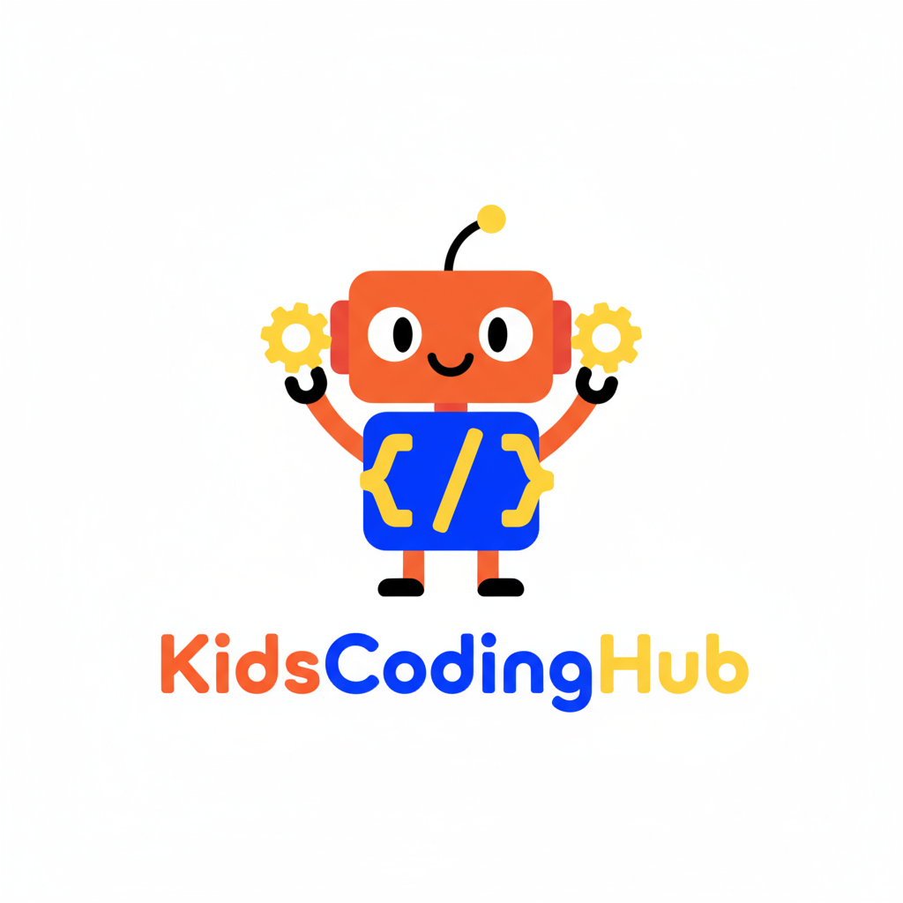
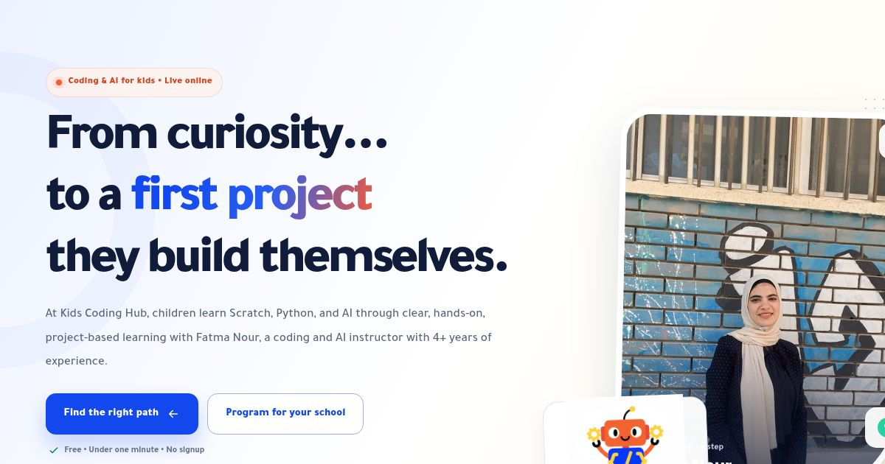

<div align="center">
  
  <h1>Kids Coding Hub</h1>
  <p><strong>Project-based coding and AI learning for children ages 5–16.</strong></p>
  <p>Arabic-first • Bilingual • Built for families, schools, and academies</p>
  <p>
    <a href="https://fatoomnoour.github.io/kids-coding-hub/"><strong>Live website</strong></a>
    ·
    <a href="https://www.kidscodinghub.it.com/">Blog</a>
    ·
    <a href="https://www.youtube.com/@fatmanour1512">YouTube</a>
    ·
    <a href="https://www.linkedin.com/in/fatma-nour-ai-trainer">Founder</a>
  </p>
</div>



## About the project

Kids Coding Hub is a bilingual learning website that helps parents choose the right coding path for their children and helps schools and academies request tailored Scratch, Python, AI, and STEAM programs.

منصة تعليمية ثنائية اللغة تساعد أولياء الأمور على اختيار المسار البرمجي المناسب لأطفالهم، وتتيح للمدارس والأكاديميات طلب برامج وورش مخصصة في Scratch وPython والذكاء الاصطناعي وSTEAM.

## Highlights

- Arabic and English experiences with correct RTL/LTR behavior.
- Learning tracks for ages 5–7, 8–11, 11–14, and 12–16.
- Interactive path finder with a personalized recommendation.
- Separate conversion journeys for parents and educational organizations.
- WhatsApp-ready parent enquiries and organization briefs.
- Real learner feedback, video projects, blog resources, and social proof.
- Responsive navigation, keyboard support, reduced-motion support, and accessible labels.
- SEO metadata, Open Graph image, Schema.org structured data, `sitemap.xml`, and `robots.txt`.
- Optional Google Analytics 4, Microsoft Clarity, and Google Search Console verification.
- Automatic GitHub Pages deployment on every push to `main`.

## Core programs

| Age | Track | Final outcome |
|---|---|---|
| 5–7 | ScratchJr Explorer | Interactive story or mini game |
| 8–11 | Scratch Game Maker | Complete game with characters, scores, and challenges |
| 11–14 | Python Project Builder | Text game or useful mini tool |
| 12–16 | Python & AI Lab | Data app or approachable AI prototype |

## Technology

- Next.js 16, React 19, and TypeScript.
- Responsive custom CSS with Arabic and English typography.
- Next.js static export for GitHub Pages.
- GitHub Actions for automatic build and deployment.
- No database is required for the public website.

## Project structure

```text
app/
├── en/page.tsx              # English route
├── KidsCodingHubPage.tsx    # Main bilingual experience
├── globals.css              # Visual system and responsive styles
├── layout.tsx               # Shared metadata and analytics
├── page.tsx                 # Arabic route
├── robots.ts                # Search crawler rules
├── sitemap.ts               # Search sitemap
└── site-config.ts           # Deployment-aware URLs and paths
tsconfig.github.json         # Static-site-only type-check scope
public/
└── media/                   # Logo, founder photo, social card, and feedback
.github/workflows/
└── deploy-pages.yml         # GitHub Pages automation
```

## Run locally

Requirements: Node.js 22.13 or later and npm.

```bash
npm ci
npm run dev
```

Open `http://localhost:3000`.

## Deploy to GitHub Pages

1. Create a public repository named `kids-coding-hub` under `Fatoomnoour`.
2. Push this project to the repository.
3. In GitHub, open **Settings → Pages → Build and deployment** and select **GitHub Actions**.
4. Open the **Actions** tab and run **Deploy Kids Coding Hub to GitHub Pages** if the first run happened before Pages was enabled.

The workflow reads GitHub's real Pages base URL and base path, builds a static export, and deploys the `out` directory. The expected project URL is:

```text
https://fatoomnoour.github.io/kids-coding-hub/
```

See [`PUBLISH-TO-GITHUB.md`](PUBLISH-TO-GITHUB.md) for copy-and-paste Windows commands.

## Optional analytics and search setup

Add these as GitHub repository variables before a deployment when the values are available:

| Variable | Purpose |
|---|---|
| `NEXT_PUBLIC_GA_MEASUREMENT_ID` | Google Analytics 4 measurement ID |
| `NEXT_PUBLIC_CLARITY_PROJECT_ID` | Microsoft Clarity project ID |
| `NEXT_PUBLIC_GOOGLE_SITE_VERIFICATION` | Google Search Console verification token |

The deployment workflow reads these repository variables automatically. Never commit private tokens or passwords to the repository.

## Founder

**Fatma Nour** — Founder of Kids Coding Hub and Coding & AI Instructor.

- [LinkedIn](https://www.linkedin.com/in/fatma-nour-ai-trainer)
- [GitHub](https://github.com/Fatoomnoour)
- [Instagram](https://www.instagram.com/fatma_nour1512/)
- [Facebook](https://www.facebook.com/share/1H1iMvRMwR/)
- [YouTube](https://www.youtube.com/@fatmanour1512)

---

<div align="center">
  <strong>Learn • Build • Share</strong><br />
  نتعلّم • نبني • نشارك
</div>
